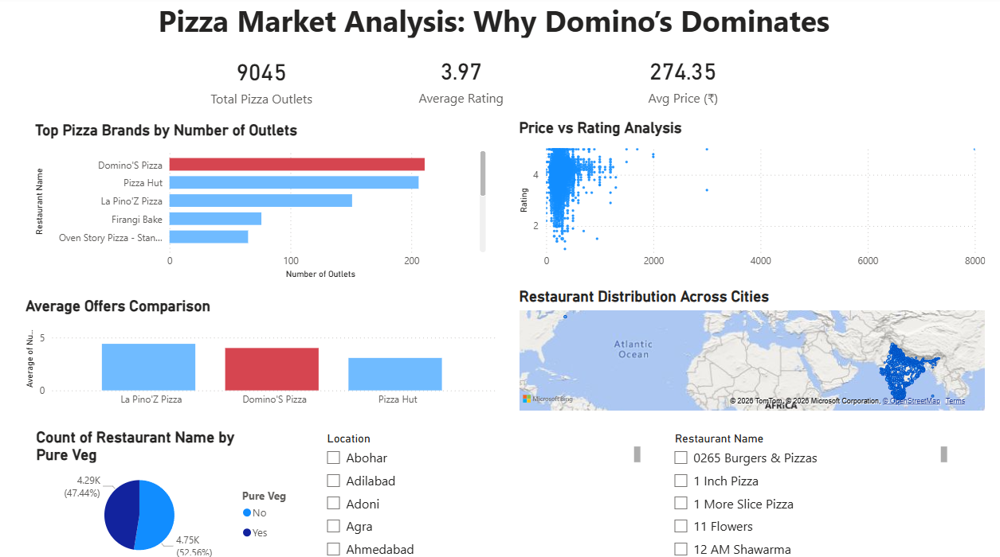

#  Pizza Market Analysis: Why Domino’s Dominates

## Overview

This project analyzes the pizza market using real-world data to understand why **Domino’s** is preferred over competitors despite not being the cheapest or highest-rated option.

The analysis combines **Python (data cleaning & exploration)** and **Power BI (interactive dashboard)** to uncover key business insights.

---

## Problem Statement

Why do consumers prefer Domino’s over competitors like Pizza Hut and La Pino’z, even when prices are higher and offers are not the best?

---

## Dataset

* Source: Swiggy Restaurants Dataset (Kaggle)
* Size: ~140,000+ restaurants
* Filtered to: Pizza-based restaurants

### Key Features Used:

* Restaurant Name
* Rating
* Average Price
* Number of Offers
* Location
* Pure Veg

---

## Tools & Technologies

* **Python**

  * pandas
  * matplotlib / seaborn
* **Power BI**

  * Dashboard creation
  * Interactive filters
* **Jupyter Notebook**

---

## Data Preprocessing

* Converted rating and price columns to numeric format
* Removed missing and inconsistent values
* Standardized restaurant names (e.g., Domino’s variations)
* Filtered dataset to include only pizza restaurants
* Removed duplicates

---

## Analysis Performed

### 1. Market Share Analysis

* Compared number of outlets across pizza brands
* Identified Domino’s as the leading brand

---

### 2. Price vs Rating Analysis

* Scatter plot analysis showed **no strong correlation** between price and rating
* Higher price does not guarantee better quality

---

### 3. Offers Comparison

* Compared promotional strategies across brands
* Found that Domino’s does not offer the highest discounts

---

### 4. Geographic Distribution

* Analyzed city-wise presence using map visualization
* Domino’s has widespread presence across multiple cities

---

### 5. Veg vs Non-Veg Analysis

* Evaluated market composition
* Found a balanced distribution catering to a broad audience

---

## Key Insights

* Domino’s has the **highest number of outlets**, ensuring strong availability
* Price is **not the deciding factor** in customer preference
* Domino’s does **not rely heavily on discounts** compared to competitors
* **Widespread geographic presence** is a major advantage
* Consumers prioritize **convenience, consistency, and brand trust**

---

## Conclusion

> Domino’s dominates the pizza market due to its extensive availability, consistent service, and strong distribution network rather than lower pricing or superior ratings.

---

## Dashboard Preview



---

## Project Structure

```
dominos-analysis/
│
├── data/
│   └── pizza_data.csv
│
├── notebook/
│   └── dominos-analysis.ipynb
│
├── dashboard/
│   └── dominos-analysis.pbix
│
├── images/
│   └── dashboard.png
│
└── README.md
```

---

## Future Improvements

* Add customer review sentiment analysis
* Include time-based trends
* Expand to other food categories

---

## Acknowledgements

* Dataset from Kaggle (Swiggy Restaurants Dataset)
  https://www.kaggle.com/datasets/rrkcoder/swiggy-restaurants-dataset

---
